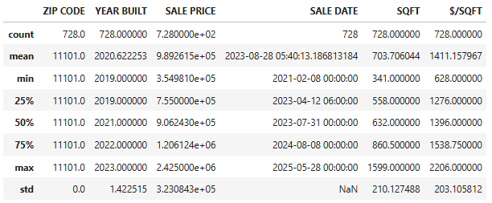
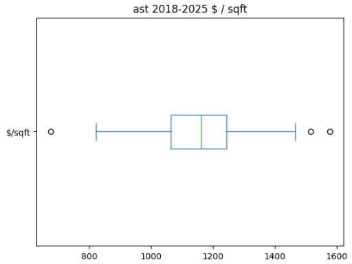

# ✨ lic-ast-condo-sales-analysis ✨

Welcome to the `lic-ast-condo-sales-analysis` repository\! 🏙️ This project delves into residential condo sales data for two dynamic neighborhoods in Queens, New York City: **Long Island City (LIC)** and **Astoria**. Using publicly available real estate transaction data, we aim to uncover insights into market trends, property values, and price per square foot.

Whether you're a real estate enthusiast, a data science learner, or just curious about NYC property, this repository offers a ready-to-use analytical pipeline.

## 🚀 Features

  * **Data Loading & Initial Exploration:** Effortlessly load raw sales data from CSV and get a quick overview.
  * **Robust Data Cleaning:** Automate the cleaning process by dropping irrelevant columns and converting data types for better analysis. 🧹
  * **Neighborhood-Specific Processing:** Focus on specific areas (LIC and Astoria) to analyze their unique market dynamics, filtering by relevant property types and sale conditions.
  * **External Data Integration:** Leverage the Socrata Open Data API to fetch crucial **Gross Square Footage (SQFT)** information for individual units, enhancing the accuracy of price calculations. 📊
  * **Price Per Square Foot Calculation:** Compute a standardized metric ($$/SQFT$) to compare property values across different units and neighborhoods.
  * **Data Export:** Export processed and enriched dataframes to CSV for further analysis or visualization. 💾

## 📊 Data Sources

This analysis relies on data from two primary sources:

  * **NYC Department of Finance (DOF) Rolling Sales Data:** The initial sales transaction data (`2020-2025.csv`) is sourced from the NYC Department of Finance, providing details on property sales, addresses, and prices. You can typically find this data on the [NYC.gov website](https://www.nyc.gov/site/finance/property/property-rolling-sales-data.page).
  * **NYC Department of Finance (DOF) - Property Valuation and Assessment Data Tax Classes 1,2,3,4 (Socrata API):** We utilize the [NYC OpenData portal's Property Valuation and Assessment Data Tax Classes 1,2,3,4](https://data.cityofnewyork.us/City-Government/Property-Valuation-and-Assessment-Data-Tax-Classes/8y4t-faws/about_data) via its Socrata API to programmatically retrieve gross square footage for specific apartment units based on address and apartment number.

## 🛠️ How to Use

To get started with this analysis, follow these steps:

### 1\. Clone the Repository

```bash
git clone https://github.com/thexqin/lic-ast-condo-sales-analysis.git
cd lic-ast-condo-sales-analysis
```

### 2\. Install Dependencies

Ensure you have Python 3.x installed. Then, install the necessary libraries using `pip`:

```bash
pip install pandas requests sodapy matplotlib
```

### 3\. Obtain a Socrata APP\_TOKEN

To use the Socrata API for fetching square footage data, you'll need an **APP TOKEN**.

  * Go to the [NYC OpenData website](https://data.cityofnewyork.us/).
  * Sign up for a free account.
  * Generate an App Token (usually found in your profile settings or when accessing API documentation).

Once you have your `APP_TOKEN`, you'll need to use it in the notebook. **For security, avoid hardcoding it directly in public repositories.** While the provided notebook code uses `APP_TOKEN` directly, in a production setting, you would load this from an environment variable or a secure configuration file.

### 4\. Place Your Data

Make sure your `2020-2025.csv` file (containing the NYC DOF sales data) is in the root directory of the cloned repository.

### 5\. Run the Jupyter Notebook

Open and run the Jupyter notebook (`lic_ast_condo_sales_analysis.ipynb`) in your preferred environment (e.g., Jupyter Lab, VS Code with Python extension).

```bash
jupyter notebook
```

Execute each cell sequentially. The notebook will:

  * Load and clean the sales data.
  * Process data specifically for Long Island City and Astoria.
  * Call the Socrata API to enrich the data with square footage.
  * Calculate and display price per square foot.
  * Export the refined data to `2019-2025-lic.csv` and `2019-2025-ast.csv`.

## 📈 Insights & Visualizations

The analysis culminates in valuable metrics like the average price per square foot for condos in LIC and Astoria. Box plots are generated to help visualize the distribution of these values, identify typical price ranges, and spot any outliers.

### Long Island City (LIC) 2019-2025 $/SQFT

This plot shows the distribution of price per square foot for condo sales in Long Island City from 2019 to 2025.




### Astoria (AST) 2019-2025 $/SQFT

This plot illustrates the distribution of price per square foot for condo sales in Astoria from 2019 to 2025.




These visualizations help in understanding the typical value range and spread of condo prices in each neighborhood, with the central line indicating the median, the box showing the interquartile range, and the "whiskers" extending to show variability outside the upper and lower quartiles. Outlier points are individually marked.

## 🤝 Contributing

Contributions are welcome\! If you have suggestions for improvements, new features, or find any bugs, please feel free to open an issue or submit a pull request.

## 📄 License

This project is licensed under the MIT License. See the `LICENSE` file for details.

Happy analyzing\! 🏠✨
