# ✨ Long Island City & Astoria Condo Sales Analysis ✨

Welcome to the `lic-ast-condo-sales-analysis` repository\! 🏙️ This project offers an in-depth look into residential condominium sales, with a primary focus on **Skyline Tower (23-15 44th Drive)** in Long Island City (LIC), and a comparative analysis of the broader LIC and Astoria markets. By analyzing publicly available real estate transaction data and enriching it with additional property details, we uncover key insights into market trends, property values, and the crucial metric of price per square foot.

Whether you're a real estate professional, a data science enthusiast, or simply curious about the NYC property market, this repository provides a ready-to-use analytical pipeline.

## 🌟 Project Overview

This Jupyter notebook-based project delivers a comprehensive analytical pipeline to:

  * **Acquire and Clean Data:** Ingest raw real estate transaction data from the NYC Department of Finance (DOF), performing robust cleaning and standardization.
  * **Enrich Data:** Integrate external data, specifically using the Socrata Open Data API to fetch crucial **Gross Square Footage (sqft)**, **Owner Information**, and **Current Tax Bills** for individual units, which are essential for accurate price per square foot calculations and deeper market insights.
  * **Analyze Market Trends:** Calculate and analyze price per square foot metrics for condo sales in LIC and Astoria, with a special deep dive into the prominent **Skyline Tower**.
  * **Visualize Findings:** Generate insightful visualizations to compare property values and distributions across both neighborhoods and within Skyline Tower, including detailed trends for the building.
  * **Tax Analysis:** Calculate and analyze property tax rates per square foot for units in Skyline Tower.
  * **Owner Demographics:** Investigate the types of owners (individual vs. corporate) within Skyline Tower, including identifying individual owners by common surname patterns.

## 🚀 Features

  * **Data Loading & Initial Exploration:** Easily load raw sales data and get a quick overview of its structure.
  * **Robust Data Cleaning:** Automate the cleaning process by dropping irrelevant columns and converting data types for better analysis.
  * **Neighborhood-Specific Processing:** Filter and process data for LIC and Astoria to analyze their unique market dynamics, focusing on specific property types and sale conditions.
  * **Address Standardization:** Clean and standardize address formats for consistency, which is crucial for successful API lookups.
  * **External Data Integration:** Leverage the Socrata Open Data API to fetch **Gross Square Footage (sqft)**, **Owner Name**, and **Current Tax Bill** for individual units, enhancing the accuracy of price calculations and providing additional context.
  * **Price Per Square Foot Calculation:** Compute a standardized $/sqft metric to enable fair comparisons of property values.
  * **Outlier Handling:** Implement filtering to remove extreme outliers in sales prices and price per square foot values, ensuring more meaningful statistical descriptions and visualizations.
  * **Tax Rate Calculation:** Calculate annual and monthly property tax per square foot for individual units.
  * **Owner Type Classification:** Distinguish between individual and corporate/LLC owners.
  * **Surname-Based Demographic Analysis:** Attempt to identify individual owners based on a list of common surnames.
  * **Data Export:** Export processed and enriched dataframes to CSV for further analysis or reporting.

## 📊 Data Sources

This analysis relies on data from two primary sources:

  * **NYC Department of Finance (DOF) Rolling Sales Data:** The initial sales transaction data (`2020-2025.csv`) is sourced from the NYC Department of Finance, providing details on property sales, addresses, and prices. You can find this data on the [NYC.gov website](https://www.nyc.gov/site/finance/property/property-rolling-sales-data.page).
  * **NYC Department of Finance (DOF) - Property Valuation and Assessment Data (Socrata API):** We use the [NYC OpenData portal's Property Valuation and Assessment Data](https://www.google.com/search?q=https://data.cityofnewyork.us/City-Government/Property-Valuation-and-Assessment-Data-Tax-Classes/8y4t-faws/about_data) via its Socrata API to programmatically retrieve gross square footage, owner name, and current tax assessments for specific apartment units.

## 📁 Project Structure

```
.
├── lic_ast_condo_sales_analysis.ipynb # Main Jupyter Notebook for analysis
├── 2020-2025.csv                      # Raw NYC DOF Rolling Sales Data
├── chart/
│   ├── lic_chart.png                  # Table for LIC $/sqft
│   ├── lic_plot.png                   # Boxplot visualization for LIC $/sqft
│   ├── ast_chart.png                  # Table for Astoria $/sqft
│   ├── ast_plot.png                   # Boxplot visualization for Astoria $/sqft
│   ├── 2315_plot.png                  # Boxplot for Skyline Tower $/sqft
│   ├── 2315_bar.png                   # Bar chart for Skyline Tower sales by month/year
│   ├── 2315_reg1.png                  # Regplot for Skyline Tower sqft vs Sale Price
│   ├── 2315_reg2.png                  # Regplot for Skyline Tower sqft vs $/sqft
│   ├── 2315_sale1.png                 # Bar chart for Skyline Tower Year vs Avg Sale Price
│   ├── 2315_sale2.png                 # Bar chart for Skyline Tower Year vs Avg $/sqft
│   └── 2315_tax.png                   # Boxplot for Skyline Tower Tax/Month/sqft
└── README.md                          # This README file
```

## 🛠️ How to Use

To run this analysis, follow these steps:

### 1\. Clone the Repository

```bash
git clone https://github.com/thexqin/lic-ast-condo-sales-analysis.git
cd lic-ast-condo-sales-analysis
```

### 2\. Install Dependencies

Using a virtual environment is highly recommended for managing dependencies.

```bash
# Create a virtual environment
python -m venv venv

# Activate the virtual environment
# On macOS/Linux:
source venv/bin/activate
# On Windows:
.\venv\Scripts\activate

# Install dependencies from requirements.txt
pip install -r requirements.txt
```

**`requirements.txt` content:**

```
pandas
requests
sodapy
matplotlib
seaborn
jupyter
```

### 3\. Obtain a Socrata APP\_TOKEN

To fetch square footage data from the Socrata API, you'll need an **APP TOKEN**.

  * Visit the [NYC OpenData website](https://data.cityofnewyork.us/).
  * Sign up for a free account.
  * Generate an App Token (typically found in your profile settings or API documentation).

**Important:** While the notebook code uses `APP_TOKEN` directly for demonstration, it's best practice to load this from an **environment variable** or a secure configuration file in a production setting to avoid hardcoding credentials in public repositories.

### 4\. Place Your Data

Ensure your `2020-2025.csv` file (containing the NYC DOF sales data) is located in the root directory of your cloned repository.

### 5\. Run the Jupyter Notebook

Open and execute the Jupyter notebook (`lic_ast_condo_sales_analysis.ipynb`). You can do this by running:

```bash
jupyter notebook
```

Execute each cell sequentially. The notebook will:

  * Load and clean the sales data.
  * Process data specifically for Long Island City and Astoria.
  * Call the Socrata API to enrich the data with square footage, owner information, and current tax bills.
  * Calculate and display price per square foot and tax per square foot.
  * Generate visualizations.
  * Export the refined data to `2018-2025-lic.csv`, `2018-2025-ast.csv`, and `23-15.csv` (these will be created in the root directory).

## ⚙️ Data Processing and Analysis Highlights

The notebook performs several key steps to transform raw data into actionable insights:

### Data Loading & Initial Inspection

```python
import pandas as pd

df = pd.read_csv('2020-2025.csv', parse_dates=['SALE DATE'])
df.info()
```

### Data Cleaning & Type Conversion

This step involves dropping unnecessary columns like `EASEMENT` and converting columns such as `ZIP CODE`, `YEAR BUILT`, and `GROSS SQUARE FEET` to appropriate integer types for better handling.

```python
df = df.drop(columns=['EASEMENT'])
df['ZIP CODE'] = df['ZIP CODE'].astype('Int64')
df['YEAR BUILT'] = df['YEAR BUILT'].astype('Int64')
df['GROSS SQUARE FEET'] = df['GROSS SQUARE FEET'].astype('Int64')
```

### Neighborhood-Specific Filtering & Standardization

The `process_neighborhood_data` function filters the main dataset for specific neighborhoods (Long Island City, Astoria) and property characteristics (e.g., `APARTMENT NUMBER` present, `BUILDING CLASS AT PRESENT` is 'R4', valid `SALE PRICE`). It then standardizes address components to ensure consistency for API lookups.

```python
def process_neighborhood_data(df, neighborhood_name, min_year_built=None):
    # ... (function definition as provided in previous output) ...
    return df_processed

dflic = process_neighborhood_data(df, 'LONG ISLAND CITY', 2018)
dfast = process_neighborhood_data(df, 'ASTORIA', 2018)

# Further address standardization
dflic['housenum'] = dflic['housenum'].str.strip().replace(r'^(\d{2})(\d{2})$', r'\1-\2', regex=True)
dflic['streetname'] = dflic['streetname'].str.strip().replace(r'ST$', 'STREET', regex=True)
# ... (similar cleaning for dfast and specific oddball addresses) ...
```

### Fetching Square Footage Data with Socrata API

A multithreaded function `get_sqft_multithreaded_sodapy` is used to efficiently query the Socrata API for `gross_sqft` based on `housenum_lo`, `street_name`, and `aptno`. This greatly enhances the accuracy of our price per square foot calculations.

```python
from sodapy import Socrata
from concurrent.futures import ThreadPoolExecutor

# ... (DATA_URL, DATA_SET, client, MAX_WORKERS definitions) ...

def check_aptno_sodapy(housenum_lo, street_name, aptno):
    # ... (function definition as provided in previous output) ...
    return sqft_value

def get_sqft_multithreaded_sodapy(df):
    # ... (function definition as provided in previous output) ...
    return sqft_values

dflic['sqft'] = get_sqft_multithreaded_sodapy(dflic)
dfast['sqft'] = get_sqft_multithreaded_sodapy(dfast)

dflic = dflic.dropna(subset=['sqft'])
dfast = dfast.dropna(subset=['sqft'])
```

### Price Per Square Foot Calculation & Neighborhood Analysis

After obtaining square footage, the $/sqft metric is calculated. Descriptive statistics and box plots are then generated, with an initial filter applied to remove extreme outliers and focus on a more typical range of values for a "reasonable price analysis."

```python
# (Reload processed data if starting here)
dflic = pd.read_csv('2018-2025-lic.csv', parse_dates=['SALE DATE'])
dfast = pd.read_csv('2018-2025-ast.csv', parse_dates=['SALE DATE'])

dflic['$/sqft'] = round(dflic['SALE PRICE'] / dflic['sqft'])
dfast['$/sqft'] = round(dfast['SALE PRICE'] / dfast['sqft'])

print("LIC Data Description (filtered for reasonable $/sqft):")
print(dflic[(dflic['$/sqft']>500) & (dflic['$/sqft']<3000)].describe())
dflic[(dflic['$/sqft']>500) & (dflic['$/sqft']<3000)]['$/sqft'].plot.box(title='LIC 2018-2025 $ / sqft', vert=False)

print("\nAstoria Data Description (filtered for reasonable $/sqft):")
print(dfast[(dfast['$/sqft']>500) & (dfast['$/sqft']<2400)].describe())
dfast[(dfast['$/sqft']>500) & (dfast['$/sqft']<2400)]['$/sqft'].plot.box(title='Astoria 2018-2025 $ / sqft', vert=False)
```

## 📈 Insights & Visualizations

The analysis culminates in key metrics like the median price per square foot for condos in LIC and Astoria. Box plots help visualize these distributions, identify typical price ranges, and highlight outliers.

### Long Island City (LIC) 2018-2025 $/sqft

This plot shows the distribution of price per square foot for condo sales in Long Island City. The central line indicates the **median**, the box represents the **interquartile range (IQR)**, and the "whiskers" show data variability outside the IQR. Outliers are plotted as individual points.

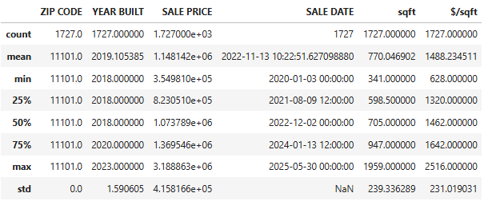
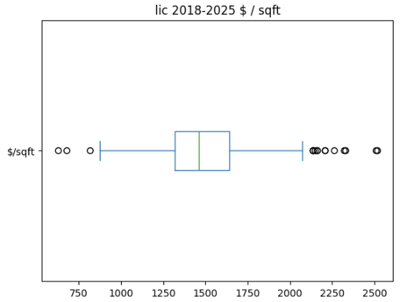

### Astoria (AST) 2018-2025 $/sqft

This plot illustrates the distribution of price per square foot for condo sales in Astoria, using the same conventions as the LIC plot.

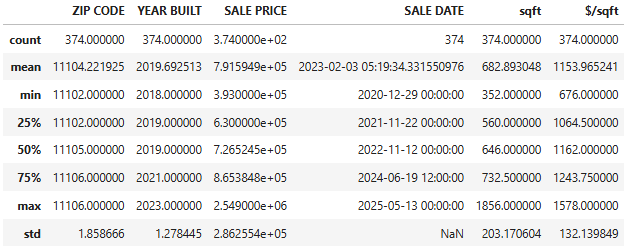
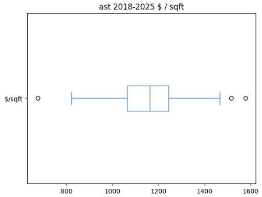

## 🏢 Deep Dive: Skyline Tower (23-15 44TH DRIVE, LIC)

A specific analysis of condo sales in **Skyline Tower** (23-15 44TH DRIVE) was conducted due to its significance in the LIC market. This involved:

  * Filtering the LIC dataset for the specific address.
  * Carefully cleaning the data to exclude **"bulk sales"** (transactions with unusually high `SALE PRICE` values that represent multiple units sold to a single entity, which would skew $/sqft calculations for individual units). Outliers, like transactions above $2,610,739 or below $492,000, were identified and removed for this specific analysis.
  * Analyzing the descriptive statistics and distribution of $/sqft for individual unit sales within Skyline Tower.
  * Visualizing monthly sales trends for this building.
  * Further detailed analysis on tax per square foot and owner demographics.

### Skyline Tower Data Processing and Initial EDA

The following code demonstrates how the data for Skyline Tower is prepared and enriched, followed by initial exploratory data analysis.

```python
df2315 = dflic[(dflic['housenum']=='23-15') & (dflic['streetname']=='44TH DRIVE')].copy()

df2315['owner'] = get_info_multithreaded_sodapy(df2315, 2)
df2315['curtxbtot'] = get_info_multithreaded_sodapy(df2315, 3)

df2315.info()
```

Output:

```
<class 'pandas.core.frame.DataFrame'>
RangeIndex: 744 entries, 0 to 743
Data columns (total 13 columns):
 #   Column                      Non-Null Count  Dtype         
---  ------                      --------------  -----         
 0   BOROUGH                     744 non-null    int64         
 1   NEIGHBORHOOD                744 non-null    object        
 2   BUILDING CLASS CATEGORY     744 non-null    object        
 3   TAX CLASS AT PRESENT        744 non-null    object        
 4   BLOCK                       744 non-null    int64         
 5   LOT                         744 non-null    int64         
 6   APARTMENT NUMBER            744 non-null    object        
 7   SALE PRICE                  744 non-null    int64         
 8   SALE DATE                   744 non-null    datetime64[ns]
 9   housenum                    744 non-null    object        
 10  streetname                  744 non-null    object        
 11  owner                       744 non-null    object        
 12  curtxbtot                   744 non-null    int64         
dtypes: datetime64[ns](1), int64(5), object(7)
memory usage: 75.7+ KB
```

### Skyline Tower Price Analysis (Filtered Data)

```python
# Reload and EDA for Skyline Tower
df2315 = pd.read_csv('23-15.csv', parse_dates=['SALE DATE'])

# Filter out bulk sales and unrealistic low prices for individual unit analysis
df2 = df2315[(df2315['SALE PRICE'] <= 2610739) &
             (df2315['SALE PRICE'] >= 492000)
             ].copy()
df2 = df2.drop(columns=['ZIP CODE', 'YEAR BUILT'])
df2 = df2.reset_index(drop=True)
df2.describe()
```

**Output:**

```
Skyline Tower (23-15 44TH DRIVE) Price Analysis (Individual Units):
          SALE PRICE                 SALE DATE         sqft      $/sqft    curtxbtot
count   7.410000e+02                       741   741.000000  741.000000   741.000000
mean    1.271171e+06 2022-06-29 22:24:46.639676160   797.202429 1597.452092  108453.222672
min     4.920000e+05 2020-07-06 00:00:00   400.000000 1126.000000   54254.000000
25%     9.687730e+05 2021-07-30 00:00:00   635.000000 1427.000000   87651.000000
50%     1.200278e+06 2022-02-28 00:00:00   724.000000 1587.000000   98128.000000
75%     1.563500e+06 2023-05-18 00:00:00   972.000000 1752.000000  131819.000000
max     2.610739e+06 2025-05-30 00:00:00  1326.000000 2516.000000  186662.000000
std     3.969332e+05                   NaN   219.647782  219.615621   30282.000286
```

### Skyline Tower $/sqft Distribution

```python
df2['$/sqft'].plot.box(title='Skyline Tower (23-15 44TH DRIVE) $ / sqft', vert=False)
```

To get an even clearer picture, a box plot excluding very high outliers in $/sqft (above $2500) is also provided:

```python
df2[df2['$/sqft'] < 2500]['$/sqft'].plot.box(title='Skyline Tower (23-15 44TH DRIVE) $ / sqft (Excluding High Outliers)', vert=False)
```

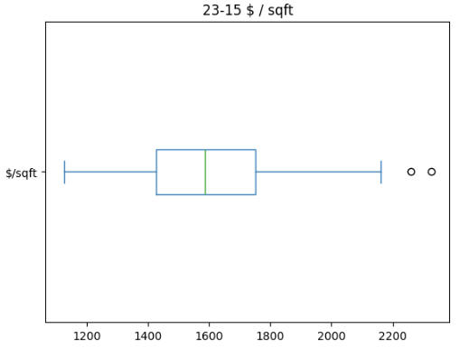

### Skyline Tower Sales Trend by Month and Year

```python
df2['month'] = df2['SALE DATE'].dt.month
df2['year'] = df2['SALE DATE'].dt.year
df2.groupby(['year', 'month']).size().plot.bar(figsize=(24, 6), rot=45, title='Skyline Tower Sales by Month')
```

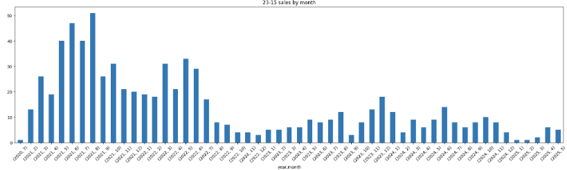

### Skyline Tower Square Footage vs. Sale Price and Price per Square Foot

These regression plots illustrate the relationship between unit size and both sale price and price per square foot within Skyline Tower.

```python
import seaborn as sns
import matplotlib.pyplot as plt

plt.figure(figsize=(14, 6))
sns.regplot(df3, x='sqft', y='SALE PRICE')
plt.title('23-15 sqft vs sale price')
plt.tight_layout()
```
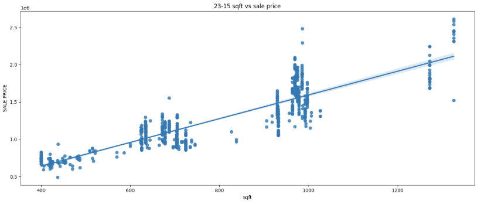

```python
plt.figure(figsize=(14, 6))
sns.regplot(df3, x='sqft', y='$/sqft')
plt.title('23-15 sqft vs $/sqft')
plt.tight_layout()
```
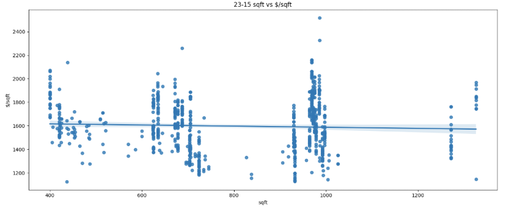

### Skyline Tower Annual Average Sale Price and Price per Square Foot Trends

These bar plots show the average sale price and average price per square foot for units in Skyline Tower across different years.

```python
plt.figure(figsize=(7, 4))
sns.barplot(df3.groupby('year')['SALE PRICE'].mean())
plt.title('23-15 year vs sale price')
plt.tight_layout()
```

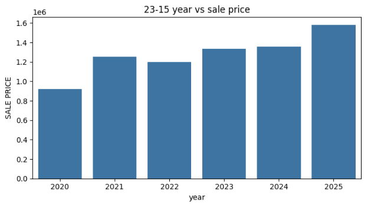

```python
plt.figure(figsize=(7, 4))
sns.barplot(df3.groupby('year')['$/sqft'].mean())
plt.title('23-15 year vs $/sqft')
plt.tight_layout()
```
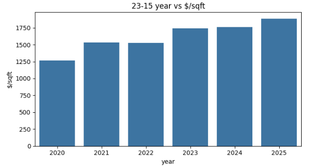

### Skyline Tower Tax Analysis

We calculated the annual and monthly property tax per square foot for units in Skyline Tower to understand recurring ownership costs.

```python
# Calculate annual and monthly tax per square foot
df3['tax/year'] = df3['curtxbtot'] * 0.125
df3['tax/year/sqft'] = round(df3['tax/year'] / df3['sqft'], 2)
df3['tax/month/sqft'] = round(df3['tax/year'] / 12 / df3['sqft'], 2)

# Display descriptive statistics for tax metrics
df3[['tax/year', 'tax/year/sqft', 'tax/month/sqft']].describe()
```

Output:

```
           tax/year  tax/year/sqft  tax/month/sqft
count  741.000000     741.000000      741.000000
mean  13556.652834      16.992321        1.414211
std    3785.250036       0.303244        0.025284
min    6781.750000      16.760000        1.400000
25%   10956.375000      16.940000        1.410000
50%   12266.000000      16.950000        1.410000
75%   16477.375000      16.950000        1.410000
max   23332.750000      23.880000        1.990000
```

The average monthly tax per square foot is approximately **$1.41**. We also identified a few units with higher than typical monthly tax per square foot (above $1.50).

```python
# Identify units with monthly tax/sqft > $1.50
df3[df3['tax/month/sqft']>1.5]
```

A box plot further visualizes the distribution of monthly tax per square foot, excluding the outliers.

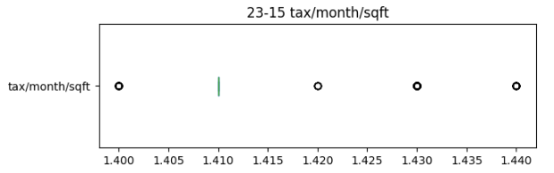

### Skyline Tower Owner Demographics

We analyzed the types of owners (individual vs. corporate entities) and identified individual owners based on common Chinese surnames.

```python
# Display top owners by count
df3.owner.value_counts()
```

Output:

```
owner
RISLAND NEW YORK LLC    8
YAO, ALAN CHIANG L      7
CHING, ORENDA ZHAN      3
HE, HUAN                3
THERESA LI, ANTHEA      3
...
GUO, SHIYI              1
ZHOU, QINGNAN           1
CHENG, SHUO             1
LIU, GANLIN             1
KO, CHUNJOO DAVID       1
Name: count, Length: 667, dtype: int64
```

We filtered out corporate entities (e.g., LLCs, Trusts) to focus on individual owners.

```python
# Filter for likely individual owners
dfindi = df3[~df3.owner.str.contains('LLC|TRUST|BOARD|INC|CORP', case=False)].copy()
# Further refine to common individual name format
dfindi = dfindi[dfindi.owner.str.fullmatch('^\s*[a-z\s\'-.]*\s*,\s*[a-z\s\'-.]*\s*$', case=False)].copy()

dfindi.owner.value_counts()
```

Output:

```
owner
YAO, ALAN CHIANG L      7
RUSSI, LUCEDY           3
CHEN, YITONG            3
TANG, KEXIN             3
MA, DAVID W.            3
...
LAI, ALEXANDER Q.       1
WANG, LAN               1
CHEN, LONG              1
WANG, AIHUA             1
CHEN, HAI JUAN          1
Name: count, Length: 574, dtype: int64
```

Using a predefined list of common Chinese surnames, we flagged individual owners.

```python
# Define common Chinese surnames and apply a function to check owner names
common_ch_surnames = [
    'wang', 'li', 'zhang', 'liu', 'chen', 'yang', 'huang', 'zhou', 'wu', 'zhao',
    'lin', 'xu', 'sun', 'ma', 'guo', 'he', 'hu', 'zhu', 'zeng', 'gao', 'lu', 'xie',
    'tang', 'deng', 'xiao', 'han', 'feng', 'dong', 'jiang', 'cai', 'yu', 'pan',
    'ding', 'lai', 'chang', 'cheng', 'wong', 'zheng'
]

def check_name(row):
    surname = row.split(',')[0].strip()
    return surname.lower() in common_ch_surnames

dfindi['ch'] = dfindi['owner'].apply(check_name)

# Display individual owners identified with common Chinese surnames
dfindi[dfindi['ch']==True].owner.value_counts()
```

Output:

```
owner
HE, HUAN                3
ZHENG, QISHENG          3
CHEN, YITONG            3
TANG, KEXIN             3
MA, DAVID W.            3
...
LAI, ALEXANDER Q.       1
WANG, LAN               1
CHEN, LONG              1
WANG, AIHUA             1
CHEN, HAI JUAN          1
Name: count, Length: 270, dtype: int64
```

Our analysis shows **270 unique individual owners** in Skyline Tower were identified with common Chinese surnames.

## 💡 Key Findings

Based on the processed residential condo sales data from 2018 to 2025, with valid sale prices, integrated square footage, and enriched owner/tax data:

  * **Long Island City (LIC):** Showed a median price per square foot ($/sqft) of approximately **$1462**. This is based on 1727 transactions within a reasonable $/sqft range ($500 - $3000), indicating a robust market.
  * **Astoria:** Recorded a lower median price per square foot of about **$1162**. This was derived from 374 transactions within its defined $/sqft range ($500 - $2400).
      * These findings suggest that, on average, LIC condominiums commanded a higher price per square foot than those in Astoria during the analyzed period. This could be due to factors like LIC's newer developments, closer proximity to Manhattan, and extensive amenities.
  * For **Skyline Tower (23-15 44TH DRIVE)**, after meticulously filtering out bulk sales and other extreme outliers:
      * The median price per square foot for individual units stands at approximately **$1587** across 741 transactions.
      * The average annual property tax for units is around **$13,557**, translating to approximately **$1.41 per square foot per month**.
      * A significant portion of individual unit sales were to buyers identified with common Chinese surnames, indicating a notable demographic presence in this specific building.
      * The sales trend visualization provides a granular view of this specific building's market performance over time.

## ➡️ Next Steps & Future Enhancements

  * **Time-Series Analysis:** Implement more advanced time-series analysis to identify seasonal patterns, long-term trends, and market shifts within specific buildings and neighborhoods.
  * **Feature Engineering:** Explore the impact of additional property features, such as building age, number of bedrooms/bathrooms, and floor level, on sale prices.
  * **Granular Geographical Analysis:** Conduct more detailed geographical segmentation within each neighborhood, perhaps by sub-areas or proximity to key landmarks and transit hubs.
  * **Additional Data Integration:** Incorporate external datasets, such as demographic information, economic indicators, or public transit access data, to enrich insights.
  * **Interactive Visualizations:** Develop interactive plots using libraries like Plotly or Bokeh for more dynamic data exploration.
  * **Machine Learning Modeling:** Build predictive models to estimate property values based on a comprehensive set of features.
  * **De-duplication Refinement:** Further refine the handling of duplicate owner names or potentially multiple units owned by a single individual/entity to ensure accurate counts where needed.

## 🤝 Contributing

Contributions are always welcome\! If you have suggestions for improvements, new features, or identify any bugs, please feel free to open an issue or submit a pull request. Please ensure your contributions align with the project's goals and maintain high code quality.

To contribute:

1.  **Fork the repository:** Click the "Fork" button at the top right of this page.
2.  **Clone your forked repository:**
    ```bash
    git clone https://github.com/thexqin/lic-ast-condo-sales-analysis.git
    cd lic-ast-condo-sales-analysis
    ```
3.  **Create a new branch for your feature or bug fix:**
    ```bash
    git checkout -b feature/your-feature-name
    ```
    or
    ```bash
    git checkout -b bugfix/issue-description
    ```
4.  **Make your changes and commit them:**
    ```bash
    git add .
    git commit -m "feat: Add your new feature"
    ```
    or
    ```bash
    git commit -m "fix: Resolve issue with data cleaning"
    ```
5.  **Push your changes to your forked repository:**
    ```bash
    git push origin feature/your-feature-name
    ```
6.  **Open a Pull Request:** Go to your forked repository on GitHub and click the "New pull request" button. Provide a clear description of your changes and reference any related issues.

## 🙏 Acknowledgments

This project utilizes publicly available data and open-source libraries. We extend our gratitude to:

  * The **NYC Department of Finance (DOF)** for providing accessible and valuable public real estate transaction data.
  * The maintainers and contributors of `pandas`, `requests`, `sodapy`, `matplotlib`, `seaborn`, and `jupyter` for their excellent work in developing and maintaining these essential libraries.
  * The broader data science and open-source communities for their continuous innovation and shared knowledge.

Happy analyzing\! What other aspects of these neighborhoods are you curious about?

Feel free to connect\!
